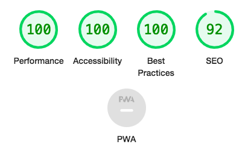

<h1>Rock Paper Scissors</h1>
 

 

This site is a simple game of Rock, Paper, Scissors played against a computer. The player game enter the game area from the home screen, chose from the three options, and keep track of their score. This site contains examples of clean, simple javascript used for both functionality and design.

 

<h2>Features</h2>

 

<h3>Home Screen</h3>

<ul>
<li>A large button at the center of the screen encourages the player to enter the game area saying "Let's Play"</li>
<li>The black button contrasts with the white background, and the colours invert when it's hovered over, for ease of reading</li>
<li>When clicked, the player enters the game area</li>
</ul>

 

<h3>Game Area</h3>

<ul>
<li>Two hand icons represent the player and the computers choices </li>
<li>Beneath the hands are three buttons to chose from</li>
<li>The black font contrasts with the white background for ease of reading</li>
</ul>

 

<h3>Score Area</h3>

<ul>
<li>The player and computers scores are tracked and diplayed in the top corners of the screen</li>
<li>The black font contrasts with the white background for ease of reading</li>
</ul>

 

<h3>Testing</h3>

<ul>
<li>I tested and confirmed this website works on Chrome, Safari and Firefox</li>
<li>I confirmed this project is responsive and functional on multiple screen sizes</li>
<li>All text and images are easy to read</li>
</ul>

<h3>Bugs</h3>

<ul>
<li>When I deployed my project to github pages I discovered some of the content was overlapping on mobile</li>
<li>This was because there was an error in my media queries, squishing the content together</li>
<li>I fixed this by adjusting display of the hand icons and buttons on mobile</li>
</ul>

 

<h3>Unfixed Bugs</h3>

No unfixed bugs

 

<h3>Testing</h3>

<ul>
<li>No errors found on the official W3C HTML validator</li>
<li>No errors found on the official Jigsaw CSS validator</li>
<li>No errors were found on the official Jshint validator, the following metrics were returned: 
There are 11 functions in this file.

Function with the largest signature take 2 arguments, while the median is 0.

Largest function has 34 statements in it, while the median is 3.

The most complex function has a cyclomatic complexity value of 8 while the median is 1.</li>
<li>No significant accessibility issues were highlighted on the devtools Lighthouse report</li>
</ul>

 

 

<h3>Deployment</h3>

The site was deployed to github pages. In the settings of my repository I selected the pages section, sourced it from the master branch and and clicked save. Github then provided a link to the deployed site which can be found <a href="https://fionatreacy.github.io/Project-2/" target="_blank" rel="noopener" class="tickets">HERE. </a>

